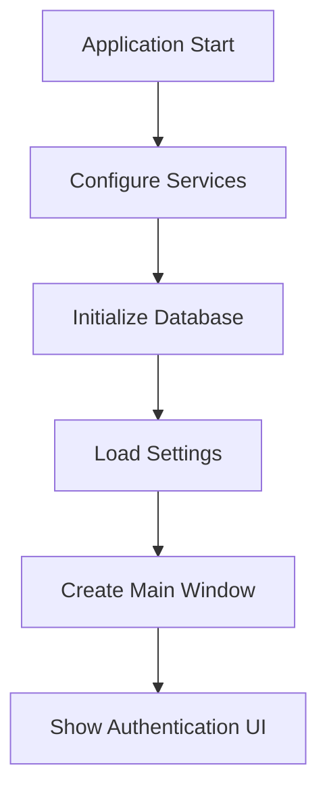
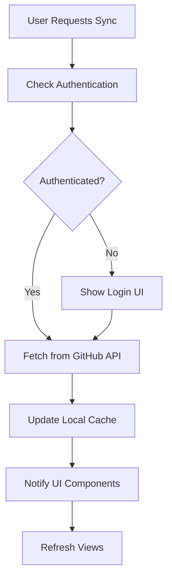
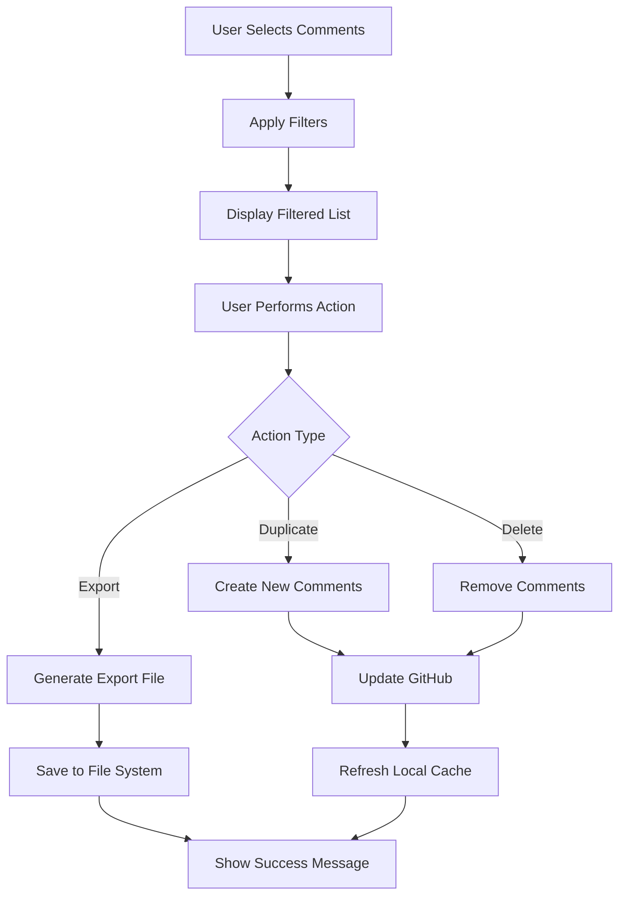

# Architecture Overview - GitHub PR Review Tool

This document provides a comprehensive overview of the GitHub PR Review Tool's architecture, design patterns, and technical decisions.

## Table of Contents

1. [High-Level Architecture](#high-level-architecture)
2. [Clean Architecture Implementation](#clean-architecture-implementation)
3. [Technology Stack](#technology-stack)
4. [Design Patterns](#design-patterns)
5. [Data Flow](#data-flow)
6. [Performance Considerations](#performance-considerations)
7. [Security Architecture](#security-architecture)
8. [Extensibility & Scalability](#extensibility--scalability)

## High-Level Architecture

The GitHub PR Review Tool follows Clean Architecture principles with clear separation of concerns and dependency inversion.

```
┌─────────────────────────────────┐
│         Presentation            │
│      (Avalonia Desktop)         │
├─────────────────────────────────┤
│        Application              │
│    (ViewModels, Services)       │
├─────────────────────────────────┤
│           Domain                │
│    (Entities, Interfaces)       │
├─────────────────────────────────┤
│       Infrastructure            │
│  (Data, External Services)      │
└─────────────────────────────────┘
```

### Layer Responsibilities

**Presentation Layer** (`GitHubPrTool.Desktop`)
- User interface components (Views, Controls)
- MVVM ViewModels and Commands
- UI-specific services and converters
- Platform-specific implementations

**Application Layer** (Part of Desktop project)
- Application logic and workflows
- Command handlers and use cases
- Cross-cutting concerns (logging, validation)
- Interface adapters

**Domain Layer** (`GitHubPrTool.Core`)
- Business entities and value objects
- Domain interfaces and contracts
- Business rules and domain logic
- Domain events and exceptions

**Infrastructure Layer** (`GitHubPrTool.Infrastructure`)
- Data persistence (Entity Framework)
- External service integration (GitHub API)
- File system and networking
- Security and caching implementations

## Clean Architecture Implementation

### Dependency Flow

```
Presentation → Application → Domain
Infrastructure → Domain
```

- **Outer layers depend on inner layers**
- **Inner layers are independent of outer layers**
- **Domain layer has no external dependencies**
- **Infrastructure implements domain interfaces**

### Interface Segregation

```csharp
// Domain defines contracts
public interface IGitHubService { ... }
public interface IRepository<T> { ... }
public interface ITokenStorage { ... }

// Infrastructure implements contracts
public class GitHubService : IGitHubService { ... }
public class RepositoryBase<T> : IRepository<T> { ... }
public class SecureTokenStorage : ITokenStorage { ... }
```

### Dependency Injection

The application uses Microsoft's built-in DI container:

```csharp
// Service registration in Program.cs
services.AddScoped<IGitHubService, GitHubService>();
services.AddScoped<IRepository<Repository>, RepositoryRepository>();
services.AddScoped<ISyncService, DataSyncService>();

// ViewModels registered as transient
services.AddTransient<MainWindowViewModel>();
services.AddTransient<CommentListViewModel>();
```

## Technology Stack

### Core Technologies

**Frontend Framework**
- **Avalonia UI 11.3**: Cross-platform .NET UI framework
- **CommunityToolkit.Mvvm**: MVVM helpers and commands
- **Reactive Extensions**: Asynchronous programming

**Backend Technologies**
- **.NET 8.0**: Runtime and base class libraries
- **C# 12**: Primary programming language
- **Entity Framework Core**: ORM for data access
- **SQLite**: Local database storage

**External Integrations**
- **Octokit.NET**: GitHub API client library
- **Microsoft.Extensions**: Dependency injection, logging, configuration
- **System.Text.Json**: JSON serialization

### Development Tools

**Build and Deployment**
- **MSBuild**: Build system
- **NuGet**: Package management
- **GitHub Actions**: CI/CD pipeline
- **PowerShell**: Build and deployment scripts

**Testing Framework**
- **xUnit**: Unit testing framework
- **FluentAssertions**: Readable test assertions
- **Moq**: Mocking framework
- **AutoFixture**: Test data generation

## Design Patterns

### Model-View-ViewModel (MVVM)

**Separation of Concerns**
```csharp
// View (XAML)
<ListBox Items="{Binding Comments}" 
         SelectedItem="{Binding SelectedComment}" />

// ViewModel
public class CommentListViewModel : ViewModelBase
{
    [ObservableProperty]
    private ObservableCollection<Comment> comments = new();
    
    [ObservableProperty]
    private Comment? selectedComment;
    
    [RelayCommand]
    private async Task LoadCommentsAsync() { ... }
}

// Model (Domain Entity)
public class Comment
{
    public int Id { get; set; }
    public string Body { get; set; }
    public string Author { get; set; }
    // ... other properties
}
```

### Repository Pattern

**Data Access Abstraction**
```csharp
// Interface in Domain
public interface IRepository<T> where T : class
{
    Task<T?> GetByIdAsync(int id);
    Task<IEnumerable<T>> GetAllAsync();
    Task<T> AddAsync(T entity);
    // ... other methods
}

// Implementation in Infrastructure
public class CommentRepository : RepositoryBase<Comment>
{
    public CommentRepository(GitHubPrToolDbContext context) 
        : base(context) { }
    
    public async Task<IEnumerable<Comment>> GetByPullRequestAsync(int prId)
    {
        return await _dbSet
            .Where(c => c.PullRequestId == prId)
            .OrderBy(c => c.CreatedAt)
            .ToListAsync();
    }
}
```

### Command Pattern

**Encapsulating User Actions**
```csharp
[RelayCommand]
private async Task DuplicateCommentsAsync()
{
    var selectedComments = Comments.Where(c => c.IsSelected).ToList();
    
    await ExecuteAsync(async () =>
    {
        foreach (var comment in selectedComments)
        {
            await _gitHubService.CreateCommentAsync(
                Repository.Owner,
                Repository.Name,
                PullRequest.Number,
                comment.Body
            );
        }
        
        await RefreshCommentsAsync();
    }, "Duplicating comments...");
}
```

### Observer Pattern

**Reactive UI Updates**
```csharp
// Property change notifications
[ObservableProperty]
private string searchText = string.Empty;

partial void OnSearchTextChanged(string value)
{
    FilterCommentsCommand.Execute(null);
}

// Event aggregation with WeakReferenceMessenger
WeakReferenceMessenger.Default.Send(new RepositorySelectedMessage(repository));
```

### Factory Pattern

**Object Creation**
```csharp
public interface IViewModelFactory
{
    T Create<T>() where T : ViewModelBase;
}

public class ViewModelFactory : IViewModelFactory
{
    private readonly IServiceProvider _serviceProvider;
    
    public ViewModelFactory(IServiceProvider serviceProvider)
    {
        _serviceProvider = serviceProvider;
    }
    
    public T Create<T>() where T : ViewModelBase
    {
        return _serviceProvider.GetRequiredService<T>();
    }
}
```

## Data Flow

### Application Startup Flow



### Data Synchronization Flow



### Comment Operations Flow



## Performance Considerations

### Caching Strategy

**Multi-Level Caching**
```csharp
public class CachedGitHubService : IGitHubService
{
    private readonly IGitHubService _innerService;
    private readonly IMemoryCache _memoryCache;
    private readonly IRepository<CachedData> _diskCache;
    
    // L1: Memory cache for immediate access
    // L2: SQLite cache for persistent storage
    // L3: GitHub API as source of truth
}
```

**Cache Invalidation**
- Time-based expiration (15 minutes default)
- Event-driven invalidation on data changes
- Manual refresh capability
- Smart cache warming

### UI Performance

**Virtualization**
```xml
<ListBox VirtualizationMode="Recycling"
         ScrollViewer.HorizontalScrollBarVisibility="Disabled">
    <ListBox.ItemsPanel>
        <ItemsPanelTemplate>
            <VirtualizingStackPanel />
        </ItemsPanelTemplate>
    </ListBox.ItemsPanel>
</ListBox>
```

**Background Processing**
```csharp
[RelayCommand]
private async Task LoadDataAsync()
{
    await Task.Run(async () =>
    {
        // Heavy processing on background thread
        var data = await ProcessLargeDatasetAsync();
        
        // Update UI on main thread
        await Dispatcher.UIThread.InvokeAsync(() =>
        {
            Items.Clear();
            Items.AddRange(data);
        });
    });
}
```

### Database Optimization

**Indexing Strategy**
```csharp
protected override void OnModelCreating(ModelBuilder modelBuilder)
{
    // Composite index for common queries
    modelBuilder.Entity<Comment>()
        .HasIndex(c => new { c.PullRequestId, c.CreatedAt })
        .HasDatabaseName("IX_Comment_PullRequest_Created");
    
    // Covering index for filtered queries
    modelBuilder.Entity<Comment>()
        .HasIndex(c => new { c.Author, c.IsResolved })
        .IncludeProperties(c => new { c.Body, c.CreatedAt });
}
```

## Security Architecture

### Authentication Security

**OAuth 2.0 Flow**
- Authorization Code flow with PKCE
- State parameter for CSRF protection
- Secure token storage using system keychain
- Automatic token refresh

**Token Management**
```csharp
public class SecureTokenStorage : ITokenStorage
{
    public async Task StoreTokenAsync(string token)
    {
        // Windows: DPAPI encryption
        // macOS: Keychain Services
        // Linux: Secret Service API
        var encryptedToken = await EncryptAsync(token);
        await SaveToSecureStorageAsync(encryptedToken);
    }
}
```

### Data Protection

**Local Data Encryption**
- Database encryption at rest
- Sensitive configuration encryption
- Memory protection for tokens

**Network Security**
- TLS 1.2+ for all communications
- Certificate pinning for GitHub API
- Request signing and validation

### Privacy Considerations

- No telemetry without explicit consent
- Local-only data processing
- Minimal data retention policies
- Clear privacy policy and permissions

## Extensibility & Scalability

### Plugin Architecture (Planned)

```csharp
public interface IPlugin
{
    string Name { get; }
    Version Version { get; }
    void Initialize(IServiceProvider services);
}

public interface ICommentFilter : IPlugin
{
    IEnumerable<Comment> Filter(IEnumerable<Comment> comments, FilterCriteria criteria);
}

public interface IDataExporter : IPlugin
{
    Task ExportAsync(IEnumerable<Comment> comments, Stream output, ExportOptions options);
}
```

### Configuration System

**Hierarchical Configuration**
```csharp
public class AppConfiguration
{
    // User settings (highest priority)
    public UserSettings User { get; set; }
    
    // Application defaults
    public DefaultSettings Defaults { get; set; }
    
    // System-specific settings
    public SystemSettings System { get; set; }
}
```

### Horizontal Scaling Considerations

While primarily a desktop application, the architecture supports:
- **Multiple instances**: Shared cache coordination
- **Team features**: Shared templates and configurations
- **Cloud sync**: Settings and preferences synchronization
- **Enterprise deployment**: Centralized configuration management

### Future Architecture Evolution

**Planned Enhancements**
- Microservices architecture for team features
- Event sourcing for audit trails
- GraphQL integration for efficient queries
- Real-time collaboration features
- Mobile companion application

**Technology Migrations**
- .NET upgrades with LTS support
- Database migration strategies
- UI framework evolution path
- Legacy compatibility maintenance

## Conclusion

The GitHub PR Review Tool's architecture balances:
- **Simplicity**: Easy to understand and maintain
- **Performance**: Responsive user experience
- **Extensibility**: Room for future enhancements
- **Security**: Secure by design principles
- **Cross-platform**: Consistent experience across platforms

The clean architecture foundation provides a solid base for evolving requirements while maintaining code quality and developer productivity.

---

For implementation details and code examples, see the [Developer Guide](developer-guide.md) and [API Reference](api-reference.md).